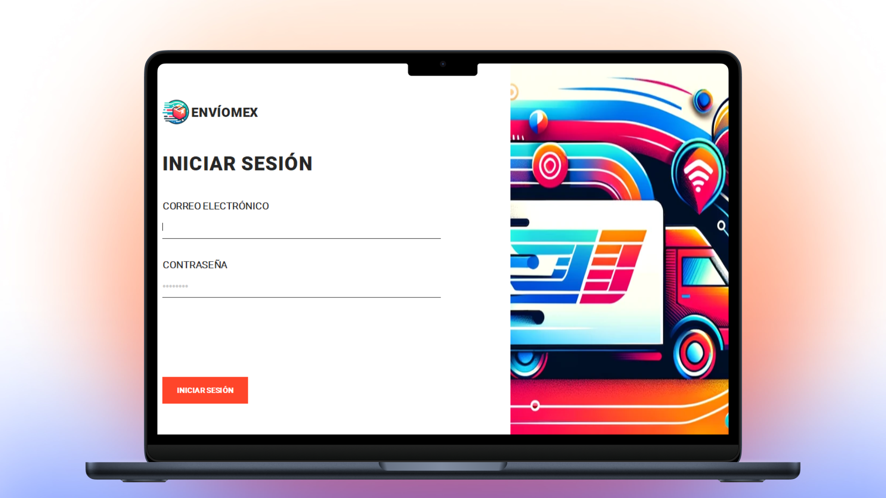

<h1 align="center">Package Delivery Management System — Java 📦</h1>
<p align="left">
  <a href="README_ES.md" target="_blank">
    Ver README en Español
  </a>
</p>

<p> This repository contains the final project for my Programming 3 course, a complete package delivery management system built using Java. The system integrates several advanced technologies to manage package records, employee assignments, reporting tools, and real-time map functionalities. The main objective of this project was to design and implement a robust, real-world application using Object-Oriented Programming (OOP) principles, SQL databases, and external libraries to handle report generation, graphical visualization, and enhanced user interface components. </p>
<hr>

<h1 align="center">Technologies Used</h1>
<div align="center">
  
  
</div>
<hr>

<h1 align="center">Objective</h1>
<ul>
  <li>Apply core <b>OOP principles:</b> encapsulation, inheritance, polymorphism, and abstraction.</li>
  <li>Develop a real-world system to <b>register, update, and deliver packages</b> efficiently.</li>
  <li>Assign and track package deliveries by <b>responsible employees.</b></li>
  <li>Generate professional reports in <b>PDF and Excel formats.</b></li>
  <li>Integrate <b>external APIs</b> to enhance functionality and <b>improve the user experience.</b></li>
</ul>
<hr>

<h1 align="center">Main Features</h1>
<ul>
  <li><b>Responsive Design:</b> Built with CSS Grid and Tailwind CSS to ensure adaptability across various screen sizes and devices.</li>
  <li><b>Tailwind CSS:</b> Full exploration of Tailwind CSS—from installation and configuration to using utility classes for styling components efficiently.</li>
  <li><b>Deployment Process:</b> Bundling and deployment prepared for production, serving as a reference for future professional setups.</li>
  <li><b>Interactive Hamburger Menu:</b> JavaScript-driven hamburger navigation enhances user experience on mobile devices.</li>
  <li><b>Map Integration:</b> View and manage delivery zones with a built-in map through API integration.</li>
  <li><b>Graphical User Interface:</b> Intuitive and user-friendly GUI for data interaction.</li>
  <li><b>Threading and Error Handling:</b> Ensures stability and performance through custom exception handling and multithreading.</li>
</ul>
<hr>

<h1 align="center">Skills Acquired</h1>
<ul>
  <li>Real-world use of OOP in Java</li>
  <li>Integration of external APIs and libraries</li>
  <li>Handling file generation (PDF, XLS) and graph visualization</li>
  <li>Connecting Java applications to relational databases</li>
  <li>Designing interactive desktop GUIs</li>
  <li>Managing application flow with threads and exceptions</li>
</ul>
<hr>

<h1 align="center">How to Use</h1>

1. Clone this repository to your local machine:
   ```sh
   git clone https://github.com/jordanmedinaortiz/package-delivery-system-java.git
   cd package-delivery-system-java
  
2. Set up the Database
   <ul>
     <li>Import the provided SQL file into your local MySQL or PostgreSQL server.</li>
     <li>Configure database credentials in the project's connection class.</li>
   </ul>

3. Compile the project
   <p>Use your preferred IDE (like IntelliJ or NetBeans) or compile manually:</p>
   
   ```sh
   javac -cp "lib/*" -d bin src/*.java

4. Run the application
  <p>Ensure all dependencies (libraries and database) are correctly linked:</p>
   
    ```sh
    java -cp "bin:lib/*" Main

5. Navigate the System
   <ul>
     <li>Login or register as an admin or delivery employee.</li>
     <li>Register packages, assign them, track deliveries, and generate reports from the GUI.</li>
   </ul>

<p>This project was developed individually as a final deliverable for Programming 3, representing a complete real-world Java application. It showcases not only technical implementation but also a focus on usability, scalability, and performance.</p>

